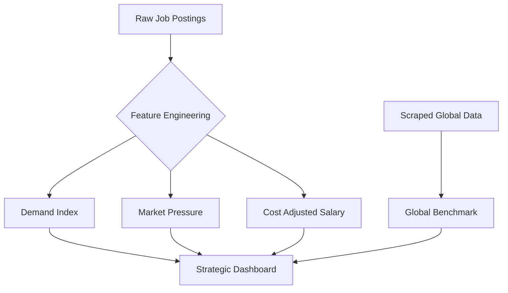

# Deep Data Analysis: Workforce Market Insights

This document provides a comprehensive technical breakdown of the data infrastructure powering the Workforce Market Insights Dashboard.

## 🏗️ Data Architecture Logic

The project's strength lies in its **Engineered Feature Layer**. Instead of relying solely on raw job postings, we've developed a suite of economic indicators that provide context to the numbers.

## 📊 Feature Intelligence (Indian Market)

We analyzed **30,000+ records** with 53 distinct attributes. Below is the technical breakdown of the most impactful engineered metrics found in the dataset:

| Metric | Business Logic | Feature Column |
| :--- | :--- | :--- |
| **Market Pressure** | Measures the intensity of competition for a role. | `job_market_pressure` |
| **Salary Adjusted Index** | Normalizes pay relative to city-level costs. | `city_salary_adjusted_index` |
| **Opportunity Score** | Identifies strategic high-potential roles. | `opportunity_score` |
| **Skill Scarcity** | Quantifies the gap for specific niche skills. | `skill_scarcity` |
| **Hiring Stability** | Measures the consistency of employment trends. | `hiring_stability` |

### Value Distributions (In-Dataset)

| Job Domain | Volume Context | Market Demand Level |
| :--- | :--- | :--- |
| **Data / Tech** | High Growth | High Demand Intensity |
| **Marketing** | Bulk Volume | Stable Demand |
| **Healthcare** | High Stability | Essential Demand |
| **Engineering** | Specialized Mid-Range | Specialized Demand |

---

## 🌍 Global Data Science Context

The `postings.csv` dataset contains **162,000+ global records**, providing a baseline to compare the Indian market against international standards.

- **Primary Focus**: Data Analytics, Machine Learning, and Data Engineering roles.
- **Geography**: Dominance of North American and Western European hubs.
- **Tech Requirements**: Focuses heavily on Python, ML frameworks, and cloud-native data stacks.

---

## 🛠️ Data Preprocessing Workflow

1. **Cleaning**: Handled missing salary ranges and standardized city/state names for consistent map visualization.
2. **Feature Mapping**: Categorized specific titles into broader `job_domain` groups for executive-level filtering.
3. **Temporal Mapping**: Derived `season` and `quarter` from timestamp data to identify hiring cyclicality.
4. **Encoding**: Included `*_encoded` columns for every major category, paving the way for downstream machine learning and predictive modeling.

---
> [!TIP]
> This data structure is optimized for both **Exploratory Data Analysis (EDA)** and **Machine Learning** pipelines.
