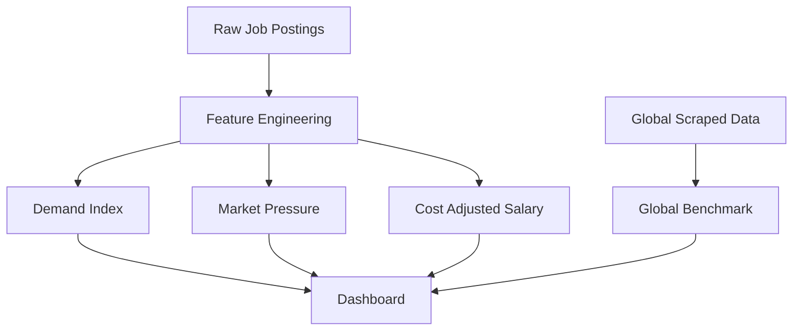

# Data Analysis: Workforce Market Insights

This document details the data structure and engineered features used in the Workforce Market Insights Dashboard.

## Data Infrastructure

The analysis is built on a combination of raw job postings and engineered features designed to provide economic context.

## Key Features (Indian Market)

The primary dataset (`1-Job_Market_India_PowerBI_Final.csv`) contains 30,000 records across 53 columns. Key engineered features include:

| Metric | Description | Column Name |
| :--- | :--- | :--- |
| **Market Pressure** | Competition intensity for a specific role. | `job_market_pressure` |
| **Adjusted Salary** | Salary normalized relative to city cost-of-living. | `city_salary_adjusted_index` |
| **Opportunity Score** | Calculated score identifying high-potential areas. | `opportunity_score` |
| **Skill Scarcity** | Gap between skill demand and supply. | `skill_scarcity` |
| **Hiring Stability** | Consistency of hiring trends over time. | `hiring_stability` |

### Market Segments

| Job Domain | Volume | Market Demand |
| :--- | :--- | :--- |
| **Data / Tech** | High Growth | High Intensity |
| **Marketing** | Bulk Volume | Stable |
| **Healthcare** | High Stability | Essential |
| **Engineering** | Specialized | Specialized |

## Global Data Context

The `postings.csv` dataset provides a global benchmark with 162,000+ records, primarily focused on North American and European markets.

- **Focus**: Data Analytics and Engineering roles.
- **Technology**: Analysis of requirements for Python, SQL, and cloud platforms.

## Data Preprocessing Workflow

1. **Cleaning**: Standardized city names and handled missing values in salary ranges.
2. **Feature Mapping**: Categorized specific job titles into broader domains for aggregate analysis.
3. **Encoding**: Included numerical encoding for categorical variables to support potential machine learning applications.
4. **Temporal Analysis**: Derived seasons and quarters to account for hiring cyclicality.
